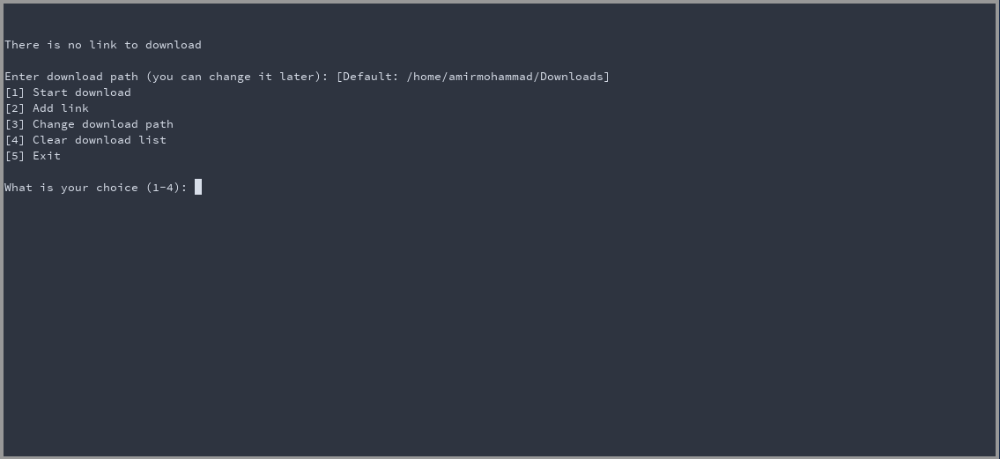

# download-manager
this is very minimal download manager written in bash using wget!!

# About
this downlowd manager written in bash script and it use wget and a for loop to download links

# How to works
its simple :D 

# How to install
just by these steps:

	1- clone the repo
	2- chmod +x install.sh
	3- ./install.sh

now you can run it by <tt>ndm / NDM</tt> command
# GUI version will add soon

   
made with love 🍀💝  
<h1>enjoy it 🕯️🍬</h1>
